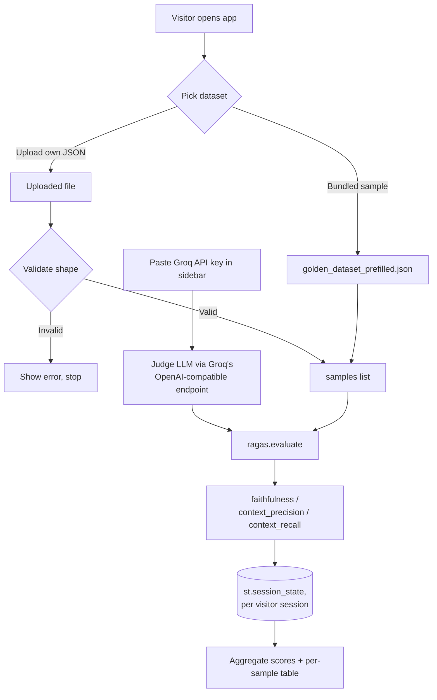

# RAGAS Eval Demo

A standalone Streamlit app that scores RAG outputs with [RAGAS](https://docs.ragas.io/)
(`faithfulness`, `context_precision`, `context_recall`), using your own
free [Groq](https://console.groq.com/keys) API key as the judge model.
No AWS credentials, no live backend, no local embeddings model, no
dependency on any other project in this repo — score the bundled
sample dataset or upload your own.

`answer_relevancy` is deliberately excluded: it's the only RAGAS metric
of the four that needs a separate embeddings model (Groq has no
embeddings API), which meant downloading and running a local
sentence-transformers model. Dropping it keeps this app to a single
Groq LLM call path — lighter dependencies, faster startup, nothing to
download.

## How it works



No step here touches this repo's other projects, AWS, or a live
backend — the only external call is to Groq's API, using whichever
key the visitor pastes in themselves.

## Run locally (CLI)

From this folder:

**Using [uv](https://docs.astral.sh/uv/) (recommended):**

```bash

uv sync
uv run streamlit run streamlit_app.py
```

**Using plain `venv`/`pip`:**

```bash

python -m venv .venv
source .venv/bin/activate      # Windows: .venv\Scripts\activate

pip install -r requirements.txt

streamlit run streamlit_app.py
```

`pyproject.toml` (for `uv sync`) and `requirements.txt` (for
Streamlit Community Cloud's own installer) declare the same
dependencies — keep them in sync if you change one.

Streamlit prints a local URL (default `http://localhost:8501`) — open
it in a browser. In the sidebar, paste a free Groq API key from
[console.groq.com/keys](https://console.groq.com/keys), then either:

- pick **"Bundled sample dataset"** and click "Run RAGAS eval", or
- pick **"Upload my own JSON"**, upload a file matching
  `golden_dataset_prefilled.json`'s shape (see below), then run.

## Custom dataset format

A JSON file with a top-level `rag_samples` list. Each sample needs:

| Field              | Type          | Meaning                                          |
|---------------------|---------------|---------------------------------------------------|
| `question`          | string        | The question asked                                |
| `reference`         | string        | Ground-truth/expected answer                       |
| `actual_response`   | string        | What your RAG system actually answered             |
| `actual_contexts`   | list[string]  | The context chunks your system retrieved           |

`id`/`domain` are optional, shown in the preview table if present. See
[`golden_dataset_prefilled.json`](golden_dataset_prefilled.json) in
this folder for a full example.

## Rate limits

RAGAS fires up to `RunConfig.max_workers` concurrent judge-LLM calls
(default 16) with no throttling of its own — enough to trip Groq's
free-tier rate limit on anything but a tiny dataset. Use the "Max
concurrent judge calls" slider in the sidebar to lower this if you see
`429`/rate-limit errors.

If you're hitting a daily token-limit `429` specifically (not just a
per-minute rate limit — Groq's error message distinguishes these),
switching models won't undo an already-exhausted quota for the day,
but different models have separate quotas. The sidebar's "Groq model"
dropdown lets you switch — smaller models (e.g. `llama-3.1-8b-instant`)
generally get more generous free-tier limits than
`llama-3.3-70b-versatile`. Pick "Custom (type below)" to use any other
model in [Groq's catalog](https://console.groq.com/docs/models) not
listed.

