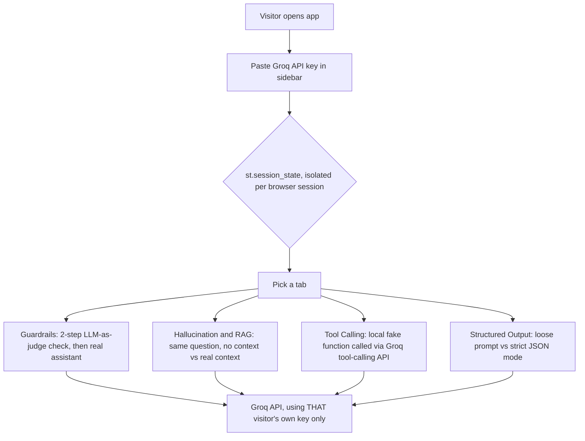

# AI Concepts — Live Lab

A standalone Streamlit app for live classroom demos. Every student opens
the same deployed URL, pastes in their **own** free
[Groq](https://console.groq.com/keys) API key, and tries a handful of
pre-written prompts per concept — some designed to succeed, some designed
to fail — to see the concept happen in front of them, right after a story
buildup. No AWS credentials, no live backend, no dependency on any other
project in this repo.

**Tabs:**
- 🛡️ **Guardrails** — a mix of benign and clearly-harmful prompts, run
  through a real (if simple) LLM-as-guardrail check before the actual
  assistant ever sees them. Shows ALLOW vs BLOCK live — and on a block,
  notice the assistant's answer box never even appears.
- 👻 **Hallucination & RAG** — the same question about invented "meeting
  notes," asked with no context (watch it confidently make something up)
  vs with the real notes pasted in (watch it answer correctly). The whole
  reason RAG exists, in one before/after.
- 🔧 **Tool Calling** — an order-status question the model has zero way to
  know, with tool calling off (guess/refusal) vs on (a local fake
  `get_order_status()` function supplies the real answer). Core of
  tool calling / MCP.
- 📋 **Structured Output** — a loose "give me JSON" instruction (often
  wrapped in prose/markdown fences, `json.loads()` fails) vs strict JSON
  mode + an explicit schema (parses cleanly every time).

## How it works



Each student's key lives only in their own `st.session_state` — never in a
module-level/global variable, which would leak across every student
sharing the one deployed process. The Groq client is
`@st.cache_resource`-cached keyed by the API key itself, so different
students' keys never collide or share a cached client. This is what makes
"many students, same URL, different Groq keys, at the same time" safe.

## Run locally (CLI)

From this folder:

**Using [uv](https://docs.astral.sh/uv/) (recommended):**

```bash
uv sync
uv run streamlit run streamlit_app.py
```

**Using plain `venv`/`pip`:**

```bash
python -m venv .venv
source .venv/bin/activate      # Windows: .venv\Scripts\activate

pip install -r requirements.txt

streamlit run streamlit_app.py
```

`pyproject.toml` (for `uv sync`) and `requirements.txt` (for Streamlit
Community Cloud's own installer) declare the same dependencies — keep
them in sync if you change one.

Streamlit prints a local URL (default `http://localhost:8501`) — open it
in a browser, paste in a free Groq API key from
[console.groq.com/keys](https://console.groq.com/keys), and click through
each tab's buttons.

## Deploy to Streamlit Community Cloud

1. Push this repo to GitHub (if not already).
2. Go to [share.streamlit.io](https://share.streamlit.io) → **New app**.
3. Point it at this repo, and set the app file to
   `37_StreamlitAppsPublic/01_ai_concept_demos/streamlit_app.py`.
4. Deploy. Share the URL with students — nothing needs to be configured on
   your end; each student supplies their own key at runtime. Nothing is
   stored in `st.secrets` for this app, on purpose.

(This repo also hosts a separate app at `37_StreamlitAppsPublic/00_evals/`
— Streamlit Community Cloud supports deploying multiple independent apps
from the same GitHub repo, each pointed at its own file path, each with
its own URL and its own running instance.)

## Capacity / rate limits

Community Cloud's free tier is a single instance (~1GB RAM), no
auto-scaling — fine for a live class of a few dozen students, not built
for hundreds of concurrent users. Since every student brings their own
Groq key, rate limits are per-student, not shared across the whole class —
one student's heavy use during a lab doesn't eat into anyone else's quota.
